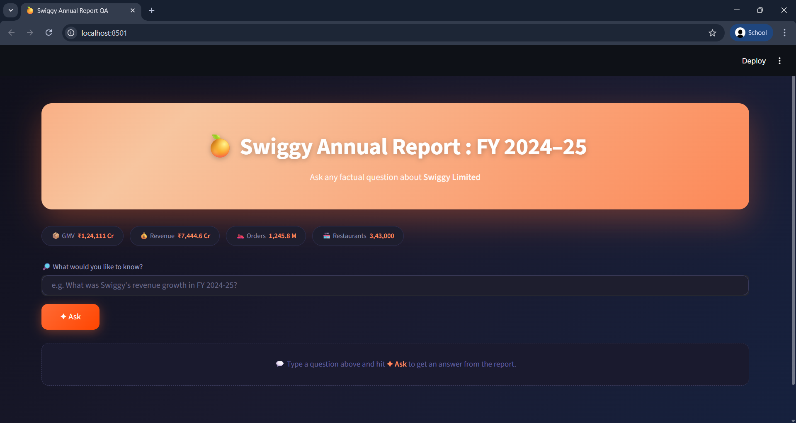
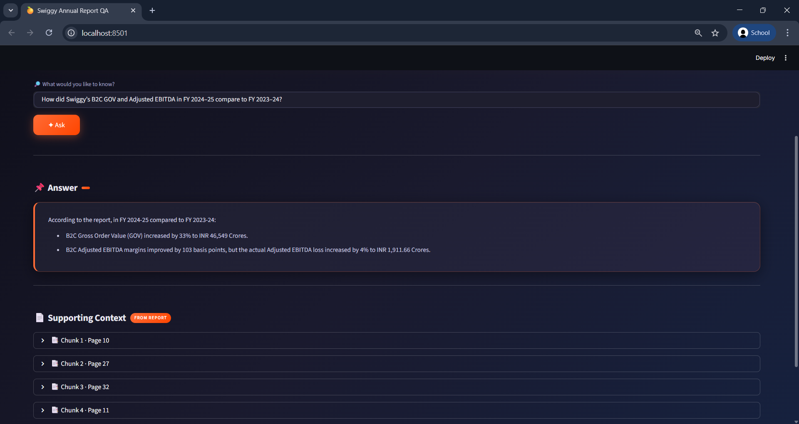

# Swiggy Annual Report QA (RAG Project)

This project is a simple Retrieval-Augmented Generation (RAG)
application built using LangChain, ChromaDB, Groq (Llama 3.1) and
Streamlit.

It allows users to ask factual questions about Swiggy Limited's FY
2024--25 Annual Report, and the system answers strictly based on the
contents of that report.

------------------------------------------------------------------------

## 🎥 Demo

  

---

## 📸 Screenshots

### 1️⃣ Main Interface

  

---

### 2️⃣ Answer with Supporting Context

  

------------------------------------------------------------------------

## Source Document

The data used in this project comes from the official Swiggy Annual
Report:

**Swiggy Annual Report 2024-25**
*"Joy, delivered. Spreading smiles across India."*

Official PDF link:
https://www.swiggy.com/corporate/wp-content/uploads/2025/07/Swiggy-Annual-Report-FY-2024-25.pdf

All responses generated by the application are grounded only in this
document.

------------------------------------------------------------------------

## What This Project Does

-   Loads the Swiggy Annual Report PDF
-   Splits it into manageable chunks
-   Converts the chunks into embeddings
-   Stores them in a Chroma vector database
-   Retrieves relevant chunks based on a user's question
-   Sends the retrieved context to an LLM (via Groq)
-   Displays:
    -   The final answer
    -   Supporting context chunks (with page numbers)

------------------------------------------------------------------------

## Tech Stack

-   Python
-   LangChain
-   ChromaDB
-   Sentence Transformers
-   Groq API (Llama 3.1)
-   Streamlit

------------------------------------------------------------------------

## Project Structure

Swiggy_InsightRAG/
│
├── src/
│   ├── app_streamlit.py
│   ├── rag_pipeline.py
│   ├── retriever.py
│   ├── ingest.py
│   ├── config.py
│   ├── components.py
│   └── styles.css
│
├── data/
│   └── Swiggy-Annual-Report-FY-2024-25.pdf
│
├── artifacts/
│   └── chroma_swiggy/   (generated)
│
├── requirements.txt
└── README.md

------------------------------------------------------------------------

## How to Run the Project

### 1. Clone the repository

    git clone <your-repo-link>
    cd Swiggy-Annual-Report-RAG

### 2. Create a virtual environment

    python -m venv venv
    venv\Scripts\activate

### 3. Install dependencies

    pip install -r requirements.txt

### 4. Add your Groq API key

Create a `.env` file in the root directory:

    GROQ_API_KEY=your_groq_api_key
    GROQ_MODEL=llama-3.1-8b-instant

### 5. Build the vector database

    python src/ingest.py

This step loads the PDF, splits it into chunks, and creates the Chroma
vector store.

### 6. Run the app

    streamlit run src/app_streamlit.py

------------------------------------------------------------------------

## Example Questions

-   What was Swiggy's revenue growth in FY 2024--25?
-   How many active users did Swiggy report?
-   What was the Gross Order Value?
-   What were the EBITDA margins?

------------------------------------------------------------------------

## Note

The model is instructed to answer only using the retrieved context from
the annual report.
If the information is not available in the document, it responds
accordingly.
